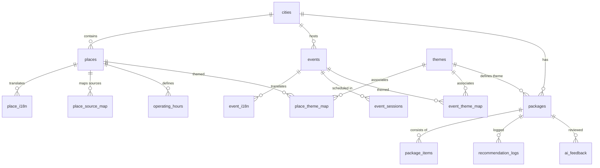

# K-Culture Curation Platform (Phase 1 MVP)

한국의 다양한 공공데이터를 기반으로 외국인(영어, 일본어, 중국어 간체/번체 사용자) 대상 다국어 문화관광 큐레이션 패키지를 추천하는 플랫폼입니다. 
서울, 부산, 경주, 전주, 남원 5개 도시를 대상으로 박물관·미술관·관광지와 국악·무용·공연·전시를 하나의 테마 패키지로 묶어 추천 동선과 지도를 함께 보여줍니다.

---

## 1. 프로젝트 개요 (Phase 1 MVP 범위)
- **온보딩 설문**: 언어 선택, 목적지 도시 선택, 여행 동반 형태(1인, 가족, 친구 등), 관심 분야(역사, K-Pop, 미식 등) 선택
- **AI/룰 기반 큐레이션**: 도시별 문화관광지 및 문화예술 공연/전시 연계 패키지 추천
- **인터랙티브 지도 및 일정**: 패키지에 포함된 장소들을 시간대별 동선(타임라인)과 지도(Google Maps) 상에 연동하여 시각화
- **아웃링크 제공**: 예매/결제 기능 없이, 상세 정보 확인 및 실제 예약을 돕기 위한 외부 공식 사이트(박물관, 공연 예매처 등) 아웃링크 연결
- **다국어(i18n) 지원**: 영어(en), 일본어(ja), 중국어 간체(zh-Hans), 중국어 번체(zh-Hant) 지원

---

## 2. 공공 API 키 발급처 및 환경변수 매핑

| 환경변수명 | API 서비스명 및 용도 | 발급처 링크 |
| :--- | :--- | :--- |
| `DATA_GO_KR_API_KEY` | 한국관광공사 TourAPI, 국립중앙박물관 소장유물 및 기타 공공 데이터 조회 | [공공데이터포털](https://www.data.go.kr/) |
| `KMA_API_KEY` | 기상청 단기예보 및 초단기실황 날씨 데이터 조회 | [기상청 API (공공데이터포털)](https://www.data.go.kr/) |
| `KOSIS_API_KEY` | 국내 도시별 문화관광 관련 통계 데이터 조회 | [KOSIS 국가통계포털](https://kosis.kr/) |
| `NEXT_PUBLIC_KAKAO_MAP_JS_KEY` | 카카오맵 로컬 지도 및 지오코딩 클라이언트 연동 | [카카오 개발자센터](https://developers.kakao.com/) |
| `KAKAO_MAP_REST_KEY` | 카카오맵 로컬 검색 및 좌표 변환 REST API | [카카오 개발자센터](https://developers.kakao.com/) |
| `KOPIS_API_KEY` | 공연예술통합전산망 내 공연/행사 정보 조회 | [KOPIS 오픈API](https://www.kopis.or.kr/) |
| `E_MUSEUM_API_KEY` 외 유물 관련 키 | e박물관 및 ict유물정보, 소장자료 등 문화 유산 데이터 조회 | [e뮤지엄 오픈API](http://www.emuseum.go.kr/) / [문화데이터광장](https://www.culture.go.kr/data/) |

---

## 3. 로컬 개발 환경 실행 방법

### 요구사항
- Node.js v18 이상
- Docker 및 Docker Compose

### 실행 절차

1. **로컬 개발용 인프라(PostgreSQL + PostGIS, Redis) 구동**
   ```bash
   docker-compose up -d
   ```

2. **의존성 패키지 설치**
   ```bash
   npm install
   ```

3. **데이터베이스 마이그레이션 실행**
   Prisma 스키마를 데이터베이스에 적용하고 클라이언트를 생성합니다. (PostGIS 확장은 마이그레이션 SQL 실행 시 자동으로 구성하거나 최초 DB 생성 시 확성화되어 있어야 합니다.)
   ```bash
   npx prisma migrate dev
   ```

4. **로컬 개발 서버 실행**
   ```bash
   npm run dev
   ```
   이후 브라우저에서 [http://localhost:3000](http://localhost:3000)으로 접속합니다.

---

## 4. 데이터 동기화 명령어 목록

배치 스크립트를 수동으로 트리거하여 최신 공공데이터 및 표기사전을 로컬 데이터베이스에 동기화할 수 있습니다.

- **한국관광공사 TourAPI 연동 (관광지 정보 동기화)**:
  ```bash
  npm run sync:tourapi
  ```
- **KOPIS 연동 (공연/행사 데이터 동기화)**:
  ```bash
  npm run sync:kopis
  ```
- **e뮤지엄 및 표준 유물 데이터 연동**:
  ```bash
  npm run sync:museum
  ```
- **서울 다국어 표기사전 임포트**:
  ```bash
  npm run import:glossary
  ```

---

## 5. 라이선스 및 사용 주의사항
- **공공누리(KOGL) 라이선스**: 본 프로젝트는 대한민국 공공기관이 제공하는 공공누리 유형별 라이선스 조건(출처 표시, 상업적 이용 금지 등)을 준수해야 합니다.
- **TourAPI 및 공공 데이터 활용 시 이미지/로고 제한**: TourAPI 및 관련 공공데이터 서비스에서 제공하는 공식 CI/BI 및 이미지는 본 서비스의 로고나 자사 브랜드 이미지로 오인될 수 있는 방식으로 변형하거나 사용할 수 없습니다. 이미지 활용 시 출처 표시 의무를 명확히 해야 합니다.

---

## 6. Supabase 데이터베이스 스키마 및 ERD

본 프로젝트는 PostgreSQL + PostGIS(공간 지리 정보 처리) 및 pgvector(AI 임베딩 벡터 검색)를 탑재한 Supabase 기반의 DB 스펙을 사용합니다.

### 데이터베이스 ERD (Entity Relationship Diagram)



### 주요 테이블 명세 (총 27개)
1. **마스터 정보**: `cities` (도시), `places` (관광지/박물관), `events` (공연/축제/전시), `themes` (여행 테마)
2. **다국어 매핑**: `place_i18n`, `event_i18n`
3. **상세 및 매핑 정보**: `place_source_map` (소스 식별), `operating_hours` (운영 시간), `event_sessions` (회차/시간표), `place_theme_map`, `event_theme_map`
4. **추천 패키지**: `packages` (추천 꾸러미), `package_items` (꾸러미 요소 상세)
5. **맥락 및 외부 데이터**: `weather_snapshots` (날씨 캐시), `mobility_cache` (이동 경로 거리/시간 캐시), `license_registry` (공공 라이선스 유형 기록)
6. **AI 임베딩 및 거버넌스**: `embeddings` (pgvector 384차원 임베딩), `model_registry` (사용 모델 관리), `ai_prompt_audit` (프롬프트 로그), `ai_interactions` (대화 세션 로그), `ai_feedback` (평가 피드백), `feature_flags` (기능 스위치), `inference_metrics` (추론 지표 통계)
7. **사용자 및 사전**: `glossary_terms` (다국어 표준 용어 사전), `editorial_curations` (에디터 추천 콘텐츠), `user_sessions` (사용자 대화 세션 상태), `recommendation_logs` (추천 노출/클릭 로그)

